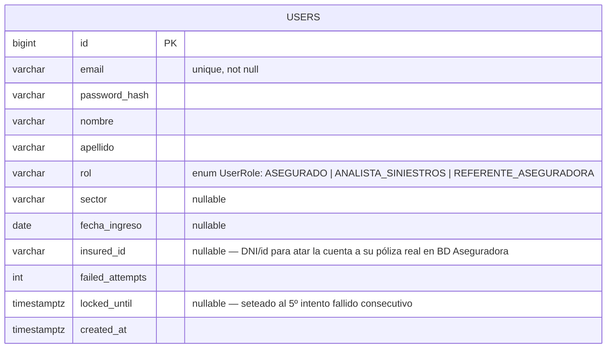
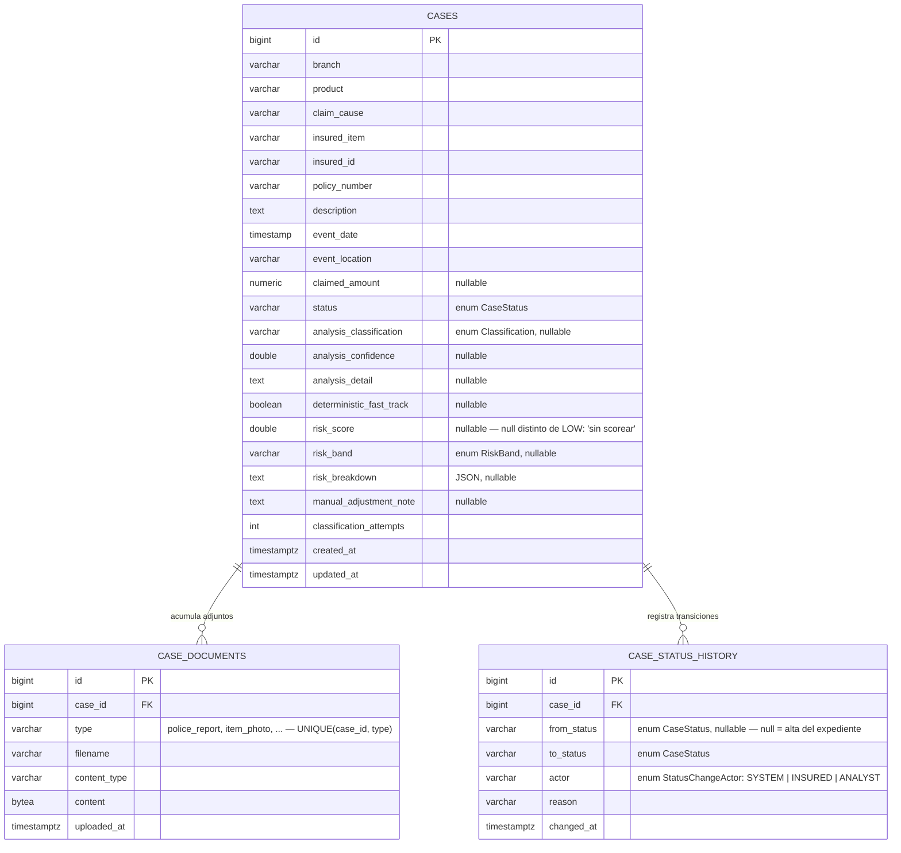
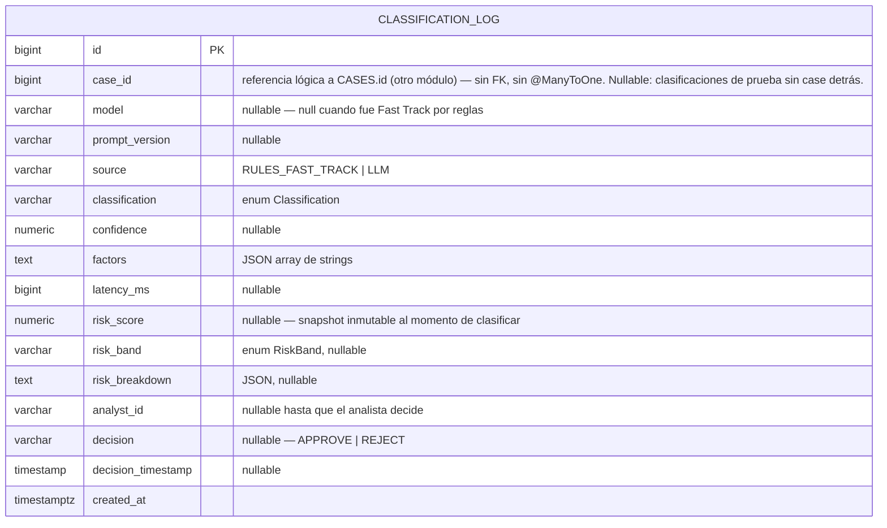
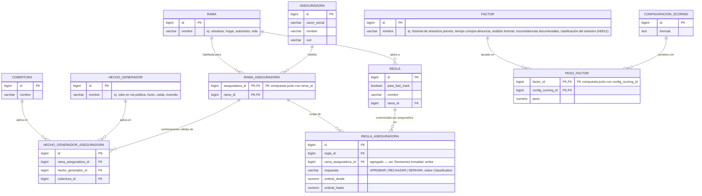
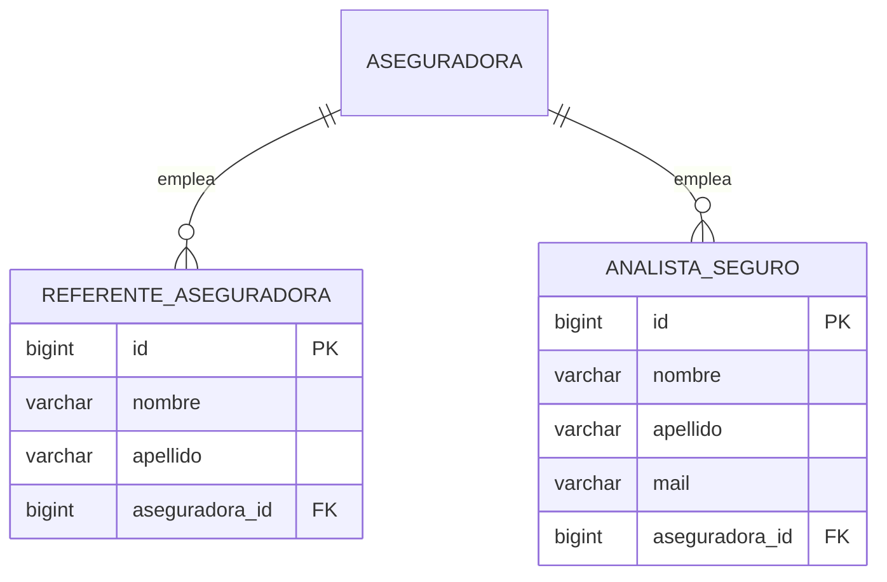
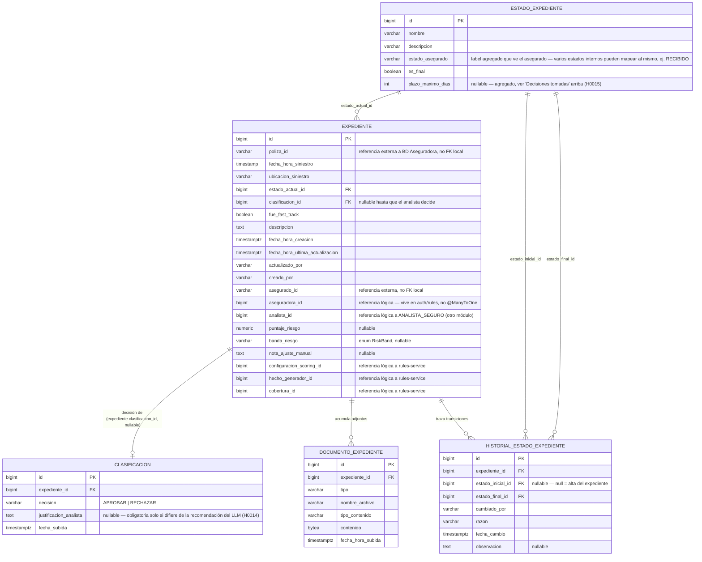
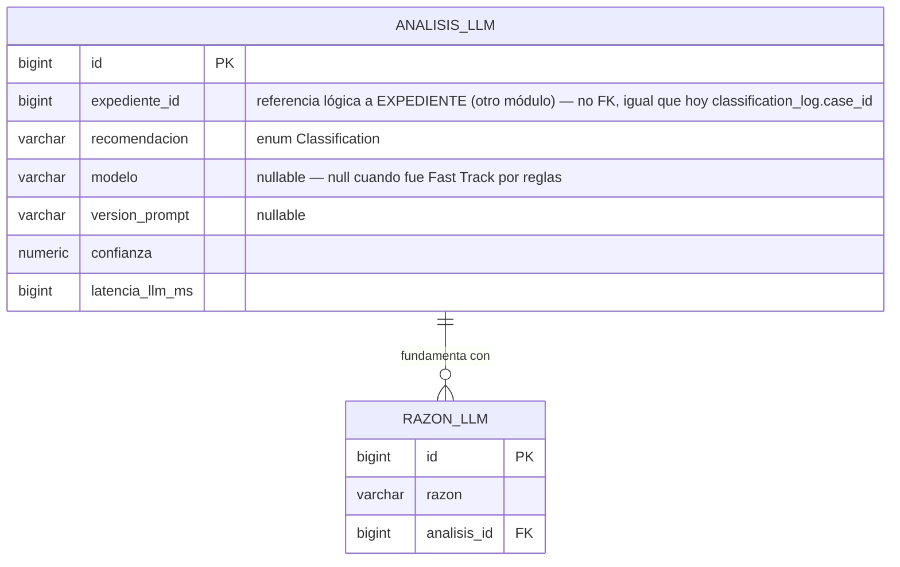

# DER — Modelo de datos de Arbiter

> Este documento tiene dos partes. La primera ("Estado actual") es un punto de partida vivo,
> derivado directamente de las `@Entity` de cada módulo y del DDL en [`db/init.sql`](../db/init.sql)
> — no del vocabulario de dominio aspiracional de `CLAUDE.md`. Se actualiza a medida que se agregan
> entidades reales.
>
> La segunda ("Modelo objetivo") documenta el diseño de datos para la próxima tanda de historias
> (H0012–H0015: scoring, Fast Track, motor de reglas, multi-tenant), partiendo de un DER dibujado a
> mano por el equipo y completado acá. **Nada de esa parte está persistido todavía** —
> `rules-service` y `reports-service` siguen siendo scaffolding vacío (solo `.gitkeep`). Se marca
> explícitamente como tal para no confundirla con la primera parte.

## Estado actual (persistido hoy)

### Alcance de esta versión

Lo que hoy **persiste de verdad**: 6 tablas, repartidas en 3 módulos con tablas propias
(`auth-service`, `cases-service`, `classification-service`).

| No incluido todavía | Por qué |
|---|---|
| `Ramo`, `Producto`, `HechoGenerador`, `AgendaDocumental`, `Regla`, catálogos de scoring | `rules-service` existe como módulo Maven pero está vacío (solo `.gitkeep`) — no hay entidades para dibujar. Ver "Modelo objetivo" más abajo para el diseño planeado. |
| `Poliza`, `Cobertura`, `Clausula`, `BienAsegurado` | No son tablas propias de Arbiter. Hoy vienen de `MockInsurerAdapter` simulando la **BD Aseguradora** externa (decisión de arquitectura #10) — se integran por base de datos compartida cuando exista, no se modelan como entidades nuestras. |
| Tenant/aseguradora en `users` | `auth-service` sí existe y persiste usuarios reales (ver abajo), pero la entidad `User` no tiene ningún campo de aseguradora/tenant todavía — el multi-tenant por esquema (decisión de arquitectura #10) no está implementado. |

### Un matiz de arquitectura que el DER tiene que respetar

**No es un único schema.** `auth-service`, `cases-service` y `classification-service` son
aplicaciones Spring Boot independientes, cada una dueña de sus tablas — se consultan por REST
interno, no por join de base de datos (ver `CLAUDE.md`, sección Arquitectura). Por eso
`classification_log.case_id` **no es una FK real**: es una referencia lógica al id de un `Case` que
vive en otro módulo. Así lo dice el propio Javadoc de la entidad:

> *"This module does NOT persist the claim/case itself (...). The log only references the owning
> case by id. It's a historical record, not a navigable relationship."*

Por eso el diagrama de abajo está separado en bloques (uno por módulo) en vez de un único
`erDiagram` con todo unido — dibujar `classification_log }o--|| cases` como si fuera una FK más
sería mentir sobre una garantía que la base de datos no está imponiendo.

### Módulo `auth-service`

**Notas:**
- Una sola tabla para los 3 roles (`rol` + `CHECK`), sin tabla de catálogo de roles ni de
  aseguradora — el multi-tenant-por-esquema (decisión #10) todavía no tocó esta entidad.
- `insured_id` es el único campo preparado para vincular un `ASEGURADO` a su registro real; queda
  `null` para `ANALISTA_SINIESTROS`/`REFERENTE_ASEGURADORA` (decisión #8 de `CLAUDE.md`).
- Sin relaciones JPA con `cases`/`classification_log` — el vínculo (¿quién es el analista de un
  expediente?) vive hoy como campos sueltos (`created_by`, `actor`, etc.), no como FK a `users`.

### Módulo `cases-service`

**Notas:**
- `case_documents`: upsert por tipo — re-subir un `type` para el mismo `case_id` reemplaza el
  registro (constraint `UNIQUE(case_id, type)`), no lo duplica.
- `case_status_history`: append-only, sin updates ni deletes — es el rastro de auditoría de cada
  transición de estado, no una tabla mutable.
- `status` (`CASES`) usa los valores de `CaseStatus` (`common-lib`): `PENDING_CLASSIFICATION`,
  `PENDING_ANALYST_REVIEW`, `CLASSIFICATION_FAILED`, `AWAITING_DOCUMENTATION`, `APPROVED`, `REJECTED`.
- `analysis_classification` (`CASES`) y `classification` (`CLASSIFICATION_LOG`, abajo) comparten el
  mismo enum `Classification`: `FAST_TRACK`, `FALTA_DOCUMENTACION`, `LLM_RECOMIENDA_APROBAR`,
  `LLM_NO_RECOMIENDA_APROBAR`, `LLM_SOLICITA_REVISION_MANUAL`. En `CASES` es un **cache de lectura**
  del último resultado; el registro de auditoría autoritativo es `CLASSIFICATION_LOG`.

### Módulo `classification-service`

**Notas:**
- Es el registro inmutable de auditoría exigido por la Disposición SSN 2/2023: un `INSERT` por cada
  corrida de clasificación, nunca se actualiza el resultado del modelo — solo se completan
  `analyst_id`/`decision`/`decision_timestamp` cuando el analista decide (`recordAnalystDecision`).
- `risk_score`/`risk_band`/`risk_breakdown` son el **snapshot autoritativo** del scoring (H0012) en
  el momento exacto de esa clasificación; los mismos campos en `CASES` son una copia de lectura del
  último valor, para no pegarle a `classification-service` por REST cada vez que se lista o se
  muestra un expediente.

### Enums compartidos (`common-lib`, no son tablas)

Viven como `VARCHAR` + `CHECK`/`@Enumerated(STRING)`, no como tablas de catálogo — están fijos en
código, no son configurables desde BD (a diferencia de `Ramo`/`HechoGenerador`, que en el modelo
objetivo de abajo sí son catálogos en tablas propias).

- **`CaseStatus`**: `PENDING_CLASSIFICATION`, `PENDING_ANALYST_REVIEW`, `CLASSIFICATION_FAILED`, `AWAITING_DOCUMENTATION`, `APPROVED`, `REJECTED`
- **`Classification`**: `FAST_TRACK`, `FALTA_DOCUMENTACION`, `LLM_RECOMIENDA_APROBAR`, `LLM_NO_RECOMIENDA_APROBAR`, `LLM_SOLICITA_REVISION_MANUAL`
- **`RiskBand`**: `LOW`, `MEDIUM`, `HIGH`, `CRITICAL`
- **`UserRole`**: `ASEGURADO`, `ANALISTA_SINIESTROS`, `REFERENTE_ASEGURADORA`
- **`StatusChangeActor`** (vive en `cases-service`, no en `common-lib`): `SYSTEM`, `INSURED`, `ANALYST`

---

## Modelo objetivo — próxima iteración (rules-service, scoring persistente, multi-tenant)

> ⚠️ **Nada de lo que sigue está construido.** Es el diseño de datos para las historias H0012
> (Scoring de riesgo), H0013 (Fast Track), H0014 (Decisión asistida) y H0015 (Motor de reglas),
> completando el DER que trajo el equipo. Sirve para planificar `rules-service` y la evolución de
> `cases-service`/`classification-service`, no describe nada persistido hoy.

### Decisiones tomadas al completar este DER

Estas son las brechas que tenía el diagrama original y cómo se resolvieron (confirmado con el
equipo, no asumido):

1. **`regla_aseguradora` no tenía forma de saber a qué aseguradora pertenece.** Se le agregó
   `rama_aseguradora_id`, reusando el mismo patrón de habilitación que ya usaba
   `hecho_generador_aseguradora` (la regla queda scoped a una combinación aseguradora+rama ya
   habilitada), en vez de un `aseguradora_id` suelto.
2. **`estado_expediente` no tenía plazo regulatorio**, pese a que H0015 pide explícitamente que el
   referente configure "plazos máximos por estado (en días hábiles)". Se agregó
   `plazo_maximo_dias` (nullable — no todos los estados tienen plazo).
3. **`referente_aseguradora` y `analista_seguro` como tablas separadas** (en vez de la `users` única
   de hoy, con `rol` + `CHECK`) se documentan como el modelo objetivo, no como algo a migrar ya. Hoy
   esos dos roles son filas de `users` sin ningún campo de aseguradora; `asegurado` directamente no
   tiene tabla propia acá tampoco — sigue siendo una referencia externa (`asegurado_id`), igual que
   `insured_id`/`insuredId` hoy.

### ⚠️ Conflicto abierto: multi-tenant por columna vs. por esquema

Este modelo objetivo resuelve el multi-tenant con **columnas `aseguradora_id` y tablas puente**
(`rama_aseguradora`, `hecho_generador_aseguradora`, `regla_aseguradora`) dentro de un mismo esquema.
Eso **choca con la decisión de arquitectura #10 de `CLAUDE.md`**: *"multi-tenant por esquema
separado por aseguradora... NO discriminación por columna `tenant_id`, NO instancia por
aseguradora"*.

No se resuelve acá — queda documentado tal cual lo dibujó el equipo (parece la decisión más
reciente/pragmática) para que el equipo lo cierre explícitamente antes de empezar a construir
`rules-service`. Si se termina yendo por columna+tablas puente, `CLAUDE.md` decisión #10 tiene que
actualizarse para no quedar contradiciendo el código.

### Catálogo de reglas y ramos — futuro `rules-service`

**Notas:**
- `hecho_generador_aseguradora.hecho_generador_id` — en el dibujo original el campo estaba nombrado
  `hecho_generador` a secas; se normalizó a `_id` acá por consistencia con el resto de las FK de la
  misma tabla (`rama_aseguradora_id`, `cobertura_id`), no porque cambie de significado.
- `cobertura` acá es un catálogo local liviano (`id`, `nombre`) usado solo para cruzar qué
  combinaciones rama+hecho_generador+cobertura son válidas por aseguradora. **No es** la `Cobertura`
  completa del vocabulario de `CLAUDE.md` (con suma asegurada y franquicia) — esa sigue viniendo de
  la BD Aseguradora externa, sin modelarse acá (mismo criterio que ya usaba la sección "Estado
  actual" para `Poliza`/`Clausula`/`BienAsegurado`).
- `regla.para_fast_track` marca si esa regla participa del circuito Fast Track (H0013); las que no,
  son reglas de exclusión/validación de cobertura evaluadas igual mediante el motor de reglas.
- `configuracion_scoring`/`peso_factor`/`factor` no tienen `aseguradora_id` — a diferencia de
  `regla`/`hecho_generador`, H0012 no pide scoring configurable por aseguradora (a diferencia de
  H0015, que sí es explícito sobre Fast Track/flujo configurable por aseguradora). Si esto cambia,
  agregar el scope ahí, no inventarlo acá.

### Usuarios por aseguradora — evolución objetivo de `auth-service`

**Notas:**
- `ASEGURADORA` es la misma entidad del bloque anterior (`rules-service`) — se repite acá solo para
  que el diagrama de usuarios se lea sin scrollear al otro bloque.
- No hay tabla `asegurado`: sigue siendo una referencia externa (hoy `insured_id`/`insuredId` en
  `users`), igual que en el estado actual.
- Sin resolver: cómo migran las filas hoy existentes de `users` (rol `ANALISTA_SINIESTROS`/
  `REFERENTE_ASEGURADORA`, sin aseguradora) a este modelo. No asumir un mecanismo — es un problema
  de migración que el equipo no cerró todavía (mismo gap ya señalado en memoria de sesiones previas
  sobre H0002/H0003).

### Expediente, clasificación y scoring — evolución objetivo de `cases-service` / `classification-service`

**Notas:**
- `estado_expediente` reemplaza el enum fijo `CaseStatus` de hoy por un catálogo configurable —
  coherente con H0015 ("el referente puede definir los estados activos del flujo"). Los diagramas de
  estado de `Arbiter Documentación` (`Diagramas de Estado de Expedientes`) usan hoy en la práctica un
  modelo más chico que la lista NSIN001 completa de la Historia H0006/H0010 (`PENDIENTE_CLASIFICACION`,
  `PENDIENTE_CLASIFICACION_MANUAL`, `REQUIERE_REVISION`, `APROBADO`, `RECHAZADO` a nivel interno; el
  asegurado ve un estado agregado tipo `RECIBIDO`/`APROBADO`/`RECHAZADO`) — de ahí sale
  `estado_asegurado` como columna separada de `nombre`.
- `clasificacion` es la **decisión final del analista** sobre el expediente (uno por expediente, vía
  `expediente.clasificacion_id`) — distinta de `analisis_llm`, que es cada corrida individual del
  modelo (puede haber varias por expediente, igual que `classification_attempts` cuenta hoy en
  `CASES`). Esto separa, más de lo que separa `classification_log` hoy, la sugerencia del modelo de
  la decisión humana (alineado con H0014: "la recomendación siempre se presenta como sugerencia; el
  Analista decide y registra su resolución").
- **Cambio de diseño respecto a hoy:** `puntaje_riesgo`/`banda_riesgo`/`nota_ajuste_manual` quedan
  como atributos directos de `EXPEDIENTE`, sin un snapshot inmutable por corrida en `ANALISIS_LLM`
  (a diferencia de `classification_log.risk_score` hoy, que es el snapshot autoritativo). Si el
  score se recalcula con cada documento nuevo (H0012: "el score se recalcula automáticamente si se
  agrega nueva documentación"), esto implica que el histórico de scores por corrida se pierde salvo
  que se reconstruya desde `historial_estado_expediente`/`analisis_llm`. Vale la pena confirmarlo
  con el equipo antes de implementar — no se decidió acá, solo se documenta la diferencia.
- `razon_llm` normaliza en filas lo que hoy es el JSON `factors` de `classification_log` — mismo
  contenido, tabla propia en lugar de columna JSON.
- No incluye `Notificación` (H0016/H0017, épica 8) ni nada de `reports-service` (H0018-H0020, épica
  9) — son historias de release R3/R4, todavía no llegó su turno de diseño de datos. No inventar
  columnas para ellas todavía.

---

## Cómo mantener esto al día

Cuando se agregue una `@Entity` nueva (por ejemplo al arrancar `rules-service`, o al tocar
`auth-service`):
1. Sumarla al bloque `erDiagram` de su módulo, en la sección "Estado actual" (o crear un bloque
   nuevo si es un módulo que hoy no tiene ninguno acá) — y sacarla del "Modelo objetivo" si ya
   estaba ahí, para no tener la misma entidad documentada dos veces.
2. Si tiene una relación **dentro del mismo módulo**, dibujarla como FK real (`||--o{`).
3. Si referencia una entidad de **otro módulo**, documentarla como referencia lógica (como
   `classification_log.case_id` arriba) — nunca como una FK cruzada, porque no existe tal cosa en
   esta arquitectura.
4. Contrastar contra `db/init.sql` (o la migración que corresponda cuando se decida Flyway/Liquibase,
   ver `CLAUDE.md`) para que los tipos y nullability no se desincronicen del DDL real.
5. Si al implementar una entidad del "Modelo objetivo" aparece una decisión distinta a la que quedó
   documentada acá (nombres de columna, nullability, el conflicto de multi-tenant sin cerrar), no
   pisarla en silencio — dejar registrado el cambio y por qué, mismo criterio que ya se usa para el
   resto del documento.
