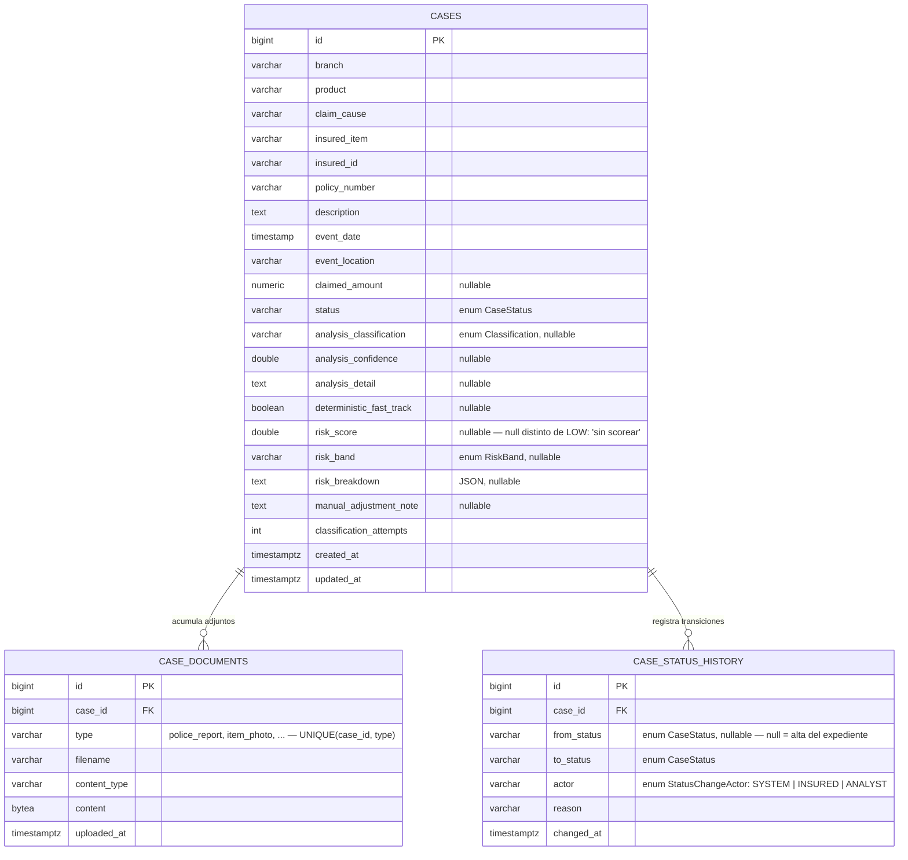
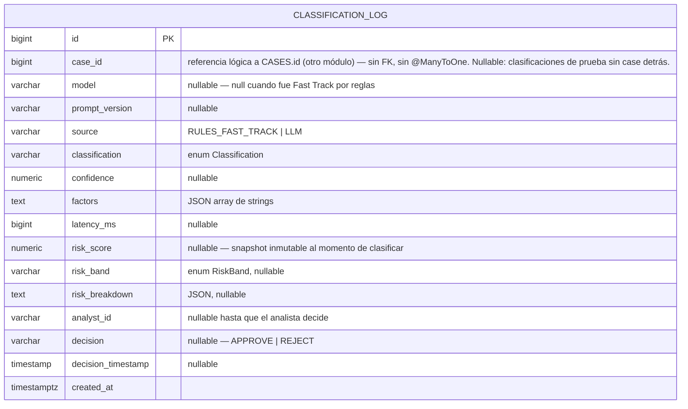

# DER — Modelo de datos de Arbiter

> Punto de partida vivo, derivado directamente de las `@Entity` de cada módulo y del DDL en
> [`db/init.sql`](../db/init.sql) — no del vocabulario de dominio aspiracional de `CLAUDE.md`.
> Se actualiza a medida que se agregan entidades reales. Última revisión: entidades existentes al
> cierre de la historia H0011 (Sprint 6).

## Alcance de esta versión

Solo lo que hoy **persiste de verdad**: 4 tablas, repartidas en 2 módulos con tablas propias.

| No incluido todavía | Por qué |
|---|---|
| `Ramo`, `Producto`, `HechoGenerador`, `AgendaDocumental` | `rules-service` existe como módulo Maven pero está vacío (solo `.gitkeep`) — no hay entidades para dibujar. |
| `Poliza`, `Cobertura`, `Clausula`, `BienAsegurado` | No son tablas propias de Arbiter. Hoy vienen de `MockInsurerAdapter` simulando la **BD Aseguradora** externa (decisión de arquitectura #10) — se integran por base de datos compartida cuando exista, no se modelan como entidades nuestras. |
| Usuarios, roles | Dependen de `auth-service` (Auth0), no levantado. |

## Un matiz de arquitectura que el DER tiene que respetar

**No es un único schema.** `cases-service` y `classification-service` son dos aplicaciones Spring
Boot independientes, cada una dueña de sus tablas — se consultan por REST interno, no por join de
base de datos (ver `CLAUDE.md`, sección Arquitectura). Por eso `classification_log.case_id` **no es
una FK real**: es una referencia lógica al id de un `Case` que vive en otro módulo. Así lo dice el
propio Javadoc de la entidad:

> *"This module does NOT persist the claim/case itself (...). The log only references the owning
> case by id. It's a historical record, not a navigable relationship."*

Por eso el diagrama de abajo está separado en dos bloques (uno por módulo) en vez de un único
`erDiagram` con todo unido — dibujar `classification_log }o--|| cases` como si fuera una FK más
sería mentir sobre una garantía que la base de datos no está imponiendo.

## Módulo `cases-service`

**Notas:**
- `case_documents`: upsert por tipo — re-subir un `type` para el mismo `case_id` reemplaza el
  registro (constraint `UNIQUE(case_id, type)`), no lo duplica.
- `case_status_history`: append-only, sin updates ni deletes — es el rastro de auditoría de cada
  transición de estado, no una tabla mutable.
- `status` (`CASES`) usa los valores de `CaseStatus` (`common-lib`): `PENDING_CLASSIFICATION`,
  `PENDING_ANALYST_REVIEW`, `CLASSIFICATION_FAILED`, `AWAITING_DOCUMENTATION`, `APPROVED`, `REJECTED`.
- `analysis_classification` (`CASES`) y `classification` (`CLASSIFICATION_LOG`, abajo) comparten el
  mismo enum `Classification`: `FAST_TRACK`, `FALTA_DOCUMENTACION`, `LLM_RECOMIENDA_APROBAR`,
  `LLM_NO_RECOMIENDA_APROBAR`, `LLM_SOLICITA_REVISION_MANUAL`. En `CASES` es un **cache de lectura**
  del último resultado; el registro de auditoría autoritativo es `CLASSIFICATION_LOG`.

## Módulo `classification-service`

**Notas:**
- Es el registro inmutable de auditoría exigido por la Disposición SSN 2/2023: un `INSERT` por cada
  corrida de clasificación, nunca se actualiza el resultado del modelo — solo se completan
  `analyst_id`/`decision`/`decision_timestamp` cuando el analista decide (`recordAnalystDecision`).
- `risk_score`/`risk_band`/`risk_breakdown` son el **snapshot autoritativo** del scoring (H0012) en
  el momento exacto de esa clasificación; los mismos campos en `CASES` son una copia de lectura del
  último valor, para no pegarle a `classification-service` por REST cada vez que se lista o se
  muestra un expediente.

## Enums compartidos (`common-lib`, no son tablas)

Viven como `VARCHAR` + `CHECK`/`@Enumerated(STRING)`, no como tablas de catálogo — están fijos en
código, no son configurables desde BD (a diferencia de `Ramo`/`HechoGenerador`, que si `rules-service`
se construye como dice `CLAUDE.md`, sí van a ser catálogos en tablas propias).

- **`CaseStatus`**: `PENDING_CLASSIFICATION`, `PENDING_ANALYST_REVIEW`, `CLASSIFICATION_FAILED`, `AWAITING_DOCUMENTATION`, `APPROVED`, `REJECTED`
- **`Classification`**: `FAST_TRACK`, `FALTA_DOCUMENTACION`, `LLM_RECOMIENDA_APROBAR`, `LLM_NO_RECOMIENDA_APROBAR`, `LLM_SOLICITA_REVISION_MANUAL`
- **`RiskBand`**: `LOW`, `MEDIUM`, `HIGH`, `CRITICAL`
- **`StatusChangeActor`**: `SYSTEM`, `INSURED`, `ANALYST`

## Cómo mantener esto al día

Cuando se agregue una `@Entity` nueva (por ejemplo al arrancar `rules-service`, o `auth-service`):
1. Sumarla al bloque `erDiagram` de su módulo (o crear un bloque nuevo si es un módulo que hoy no
   tiene ninguno acá).
2. Si tiene una relación **dentro del mismo módulo**, dibujarla como FK real (`||--o{`).
3. Si referencia una entidad de **otro módulo**, documentarla como referencia lógica (como
   `classification_log.case_id` arriba) — nunca como una FK cruzada, porque no existe tal cosa en
   esta arquitectura.
4. Contrastar contra `db/init.sql` (o la migración que corresponda cuando se decida Flyway/Liquibase,
   ver `CLAUDE.md`) para que los tipos y nullability no se desincronicen del DDL real.
